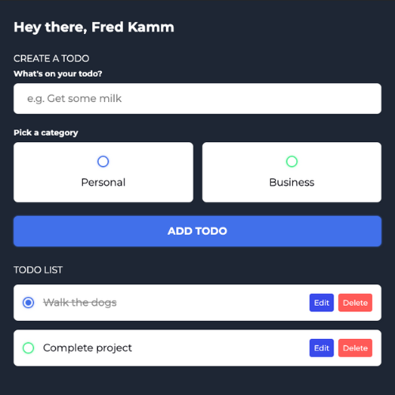

# Todo-List-App

This is a simple todo list used to keep track of things that i need to accomplish. This todo list has the ability to edit and delete items on the list. And it also crosses of the item on the list when i finish doing that objective.

# Inspiration

I wanted to improve on my local storage skills and the best project to practice with using local storage is creating a todo list app that will remember information that a user typed in from previous sessions. 

# Usage

    <a href="https://fredstodoapp.netlify.app/">
        Visit my app here!
    </a>

 

    

# Tools Used

- 
- 
- 

# Questions

    
Any questions or would like to collaborate Please shoot me an <a href="mailto:fred.kamm95@gmail.com"> Email </a>

    
If you would like to view more of my work  Visit my <a href="https://github.com/fredkamm ">Github</a> profile

